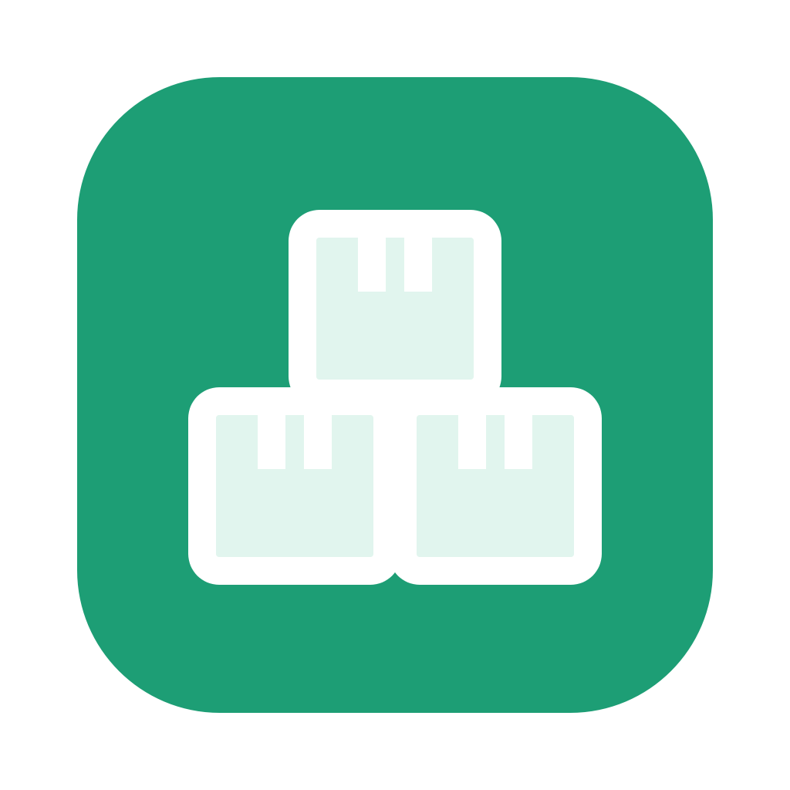

# Qave Inventory

A small desktop app for tracking stock: add items, check them out, restock, and see
what's running low. Data can live on your computer or in a **shared Google Sheet**,
so several people can use the app at once and anyone can view the data in the browser.



## Features

- Add, check out, restock/return, edit, and remove items (double-click a row to check out)
- **Item types** (Test Bench, TBox, Instruments, Cables, Disc, …) decide how an item is
  tracked: by **serial number**, in **batches**, or by **count**. Add new types from the
  Type dropdown with **+ New type…**
- **Serial-numbered items** are loaned out unit by unit, with a note of where each one went.
  Each unit has a status: working, loaned, broken, in repairs, or dormant
- **Batches** (e.g. discs): each has a nickname, serial number, and quantity
- Low-stock and out-of-stock highlighting, with an adjustable alert level
- Search box, plus a "Last change" column showing who changed each item and when
- **Google Sheets sync**: the sheet acts as the database. The app pulls changes every
  minute (or when you click **↻ Sync**), and every change is written straight to the sheet
- A **Log** tab in the sheet records every change: time, person, action, and amount
- Works offline in local mode. In Sheets mode it keeps showing the last synced data if
  the connection drops

## Install

**On any Apple Silicon Mac**, paste this into Terminal:

```bash
curl -fsSL https://raw.githubusercontent.com/shivthakar-vital/qave-inventory/main/install.sh | bash
```

See **[INSTALL.md](INSTALL.md)** for step-by-step instructions to share with coworkers,
including how to connect to the shared sheet.

### Building it yourself

`./build_mac.sh --install` builds `Qave Inventory.app` from source and copies it to
`/Applications`. Drop `--install` to only build into `dist/`.

To publish a new version for everyone, push a tag such as `git tag v1.0.1 && git push origin v1.0.1`.
GitHub Actions builds the app and attaches it to a GitHub Release, which the install line downloads.

**Windows:** run `build_windows.bat` on a Windows PC with Python 3. The app ends up in
`dist\Qave Inventory\Qave Inventory.exe`.

**Run from source (for development):**

```bash
python3 -m venv .venv && .venv/bin/pip install -r requirements.txt
.venv/bin/python qave_inventory.py
```

## Connect a Google Sheet

The app signs in to Google with a *service account*: a robot Google account that you
share the sheet with. This is a one-time setup, about 10 minutes.

1. **Create a Google Cloud project.** Go to <https://console.cloud.google.com/>, then
   project picker → **New project** (for example, `qave-inventory`).
2. **Enable the API.** Go to **APIs & Services → Library**, search for
   **Google Sheets API**, and click **Enable**.
3. **Create the service account.** Go to **APIs & Services → Credentials →
   Create credentials → Service account**. Give it a name (for example,
   `inventory-bot`) and click **Done**. Skip the optional role steps.
4. **Download a key.** Click the new service account → **Keys → Add key →
   Create new key → JSON**. A `.json` file downloads. Keep it private: anyone with the
   file can edit sheets shared with the account.
5. **Create the sheet** at <https://sheets.new> (or use an existing one).
6. **Share the sheet** with the service account's email, which looks like
   `inventory-bot@your-project.iam.gserviceaccount.com`, as an **Editor**.
7. **Configure the app.** In the app, click **⚙ Settings**, paste the sheet link, click
   **Choose key file…**, pick the JSON file, then click **Save**.

The app creates **Inventory**, **Units**, **Types**, and **Log** tabs. If you were already using the
app locally and the sheet is empty, it offers to upload your existing items.

Each teammate installs the app and repeats step 7 with the same link and key file.

> If sharing with the service account fails ("can't share outside your organization"),
> your Google Workspace admin may need to allow it, or create the service account in the
> company's Google Cloud organization.

## Types and tracking

Every item has a **Type**, and each type is tracked one of three ways:

| Tracking | Default types | How it works |
|----------|---------------|--------------|
| Serial number per unit | Test Bench, TBox, Instruments | Each unit has its own serial number (e.g. `HT-12005`) and status |
| Batches | Disc | Each batch has a nickname, serial number, and quantity (e.g. `IM3.3 · 1000233-01 A · 10`) |
| Count only | Cables | Just a quantity |

To add a type, pick **+ New type…** at the bottom of the Type dropdown, then name it and
choose how it's tracked. It's saved to the sheet's **Types** tab, so everyone gets it. To
rename or delete a type, edit the Types tab directly.

For serial and batch items, the quantity comes from the units or batches. Select the
item and click **Serial numbers…** or **Batches…** to add, edit, or remove them. On a
serial number, you can also change the status straight from the dropdown. To change an
item's name or type, use **Edit…**.

### Checking out and returning

| Type | − Check out | + Restock / ↩ Return |
|------|-------------|----------------------|
| Serial number | Pick the serial number, note where it's going. It's marked **loaned** | Pick a loaned unit and set its condition (working, broken, …) |
| Batches | Pick the batch, choose how many, add an optional note | Pick the batch and choose how many |
| Count | Choose how many, add an optional note | Choose how many |

Every movement, with its note, is recorded in the **Log** tab.

### Sheet format

**Inventory** tab: one row per item

| id | name | type | qty | updated_at | updated_by |
|----|------|------|-----|------------|------------|

**Units** tab: one row per serial-numbered unit or batch

| id | item_id | item | nickname | serial | qty | status | notes | loaned_to | updated_at | updated_by |
|----|---------|------|----------|--------|-----|--------|-------|-----------|------------|------------|

**Types** tab: `name` and `tracking` (`serial`, `batch`, or `count`)

You can edit the sheet by hand, and you never need to fill in the `id` columns:

- **Add an item:** a row with just a `name` (plus `type` and `qty`) works.
- **Add a unit or batch:** on the Units tab, `item` (the item's name) and `serial` are
  enough (plus `nickname` and `qty` for batches).
- **Rename an item:** just change its `name`. Its units stay linked through `item_id`.

On the next sync, the app fills in missing `id` / `item_id` values, gives copy-pasted rows
a fresh `id`, and updates the Units tab's `item` column to match renamed items.
Columns are matched by header name, so you can reorder them or add your own columns next to them.

## Where data is stored

Settings, the local data file, and the key are kept in
`~/Library/Application Support/QaveInventory/` on macOS or `%APPDATA%\QaveInventory\`
on Windows, never in this repo. `.gitignore` excludes data files and keys, so they
can't be committed by accident.

## Project layout

| File | What it is |
|------|------------|
| `qave_inventory.py` | The app window (PyQt5) |
| `inventory_store.py` | Data layer: local JSON and Google Sheets backends |
| `build_mac.sh` / `build_windows.bat` | Build the standalone app with PyInstaller |
| `install.sh` | One-line installer that downloads the latest release |
| `.github/workflows/release.yml` | Builds and publishes the Mac app when a version tag is pushed |
| `scripts/make_icon.py` | Regenerates `assets/icon.png` and `icon.icns` |
